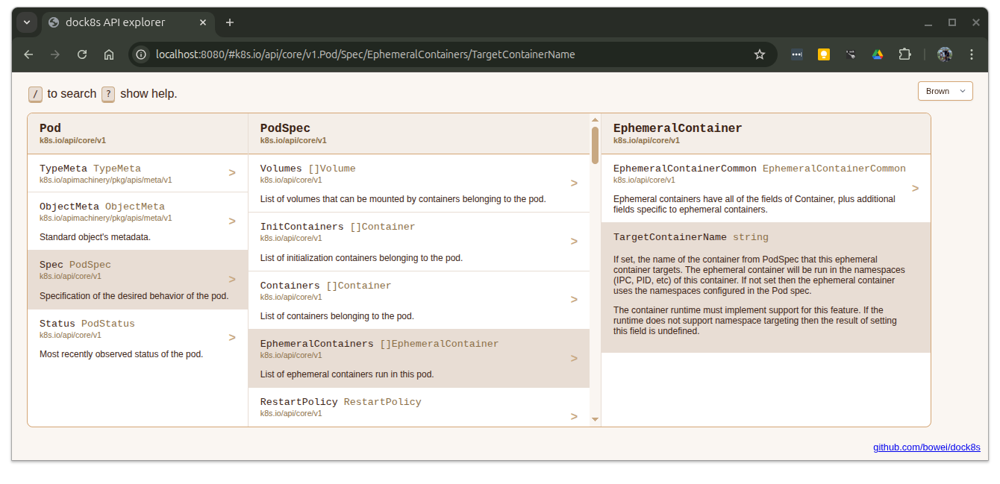

# dock8s

dock8s is a API explorer for Kubernetes APIs defined in Golang.



## Serve API docs

Start a web server on localhost, serving the APIs in the `./apis` directory.

```
dock8s -serve ./apis
```

dock8s will watch the directory for any changes and regenerate the docs as they
change. Documentation will be generated for any subdirs detected to contain
Kubernetes API definitions

Specify multiple specific API directories to include. This is useful if you want
to omit alpha or beta API directories:

```
dock8s -serve ./apis/v1beta1 ./apis/v1
```

## Generate API docs

Generate the API docs to a destination folder:

```
mkdir api-website
dock8s -generate ./api-website ./apis
```

## Quickstart example

Open API doc viewer for Gateway API:

```
$ git clone git@github.com:kubernetes-sigs/gateway-api.git
$ cd gateway-api
$ dock8s -serve apis apisx
```
